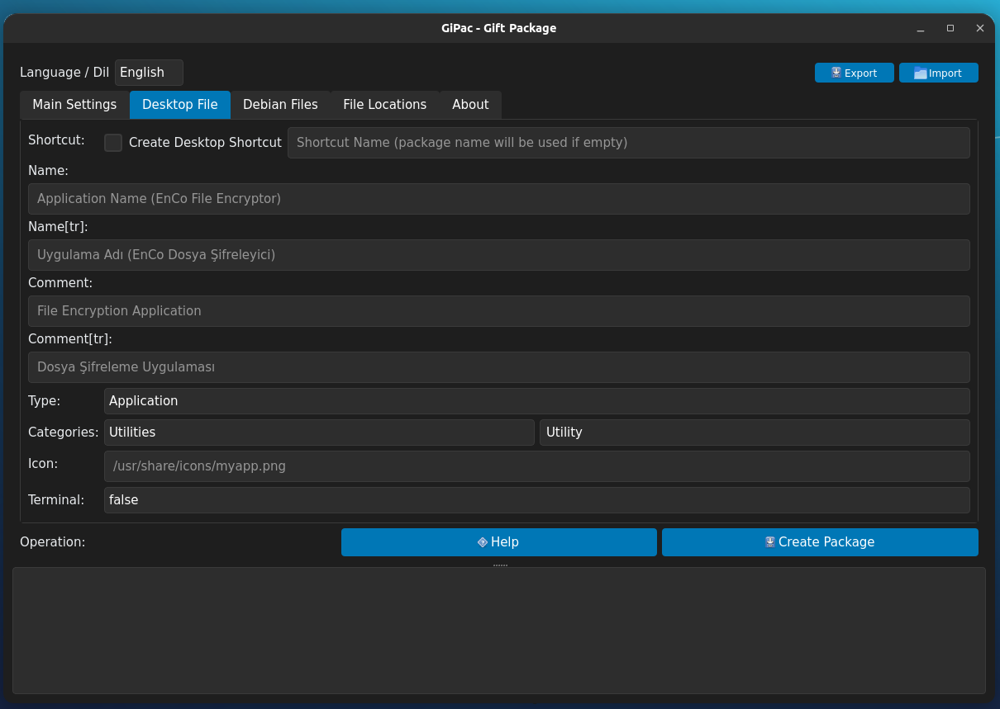
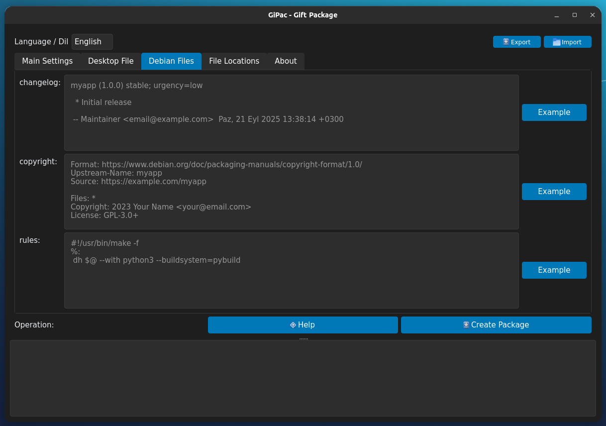
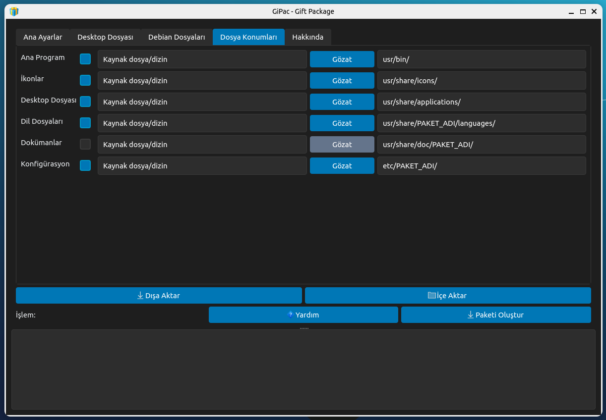
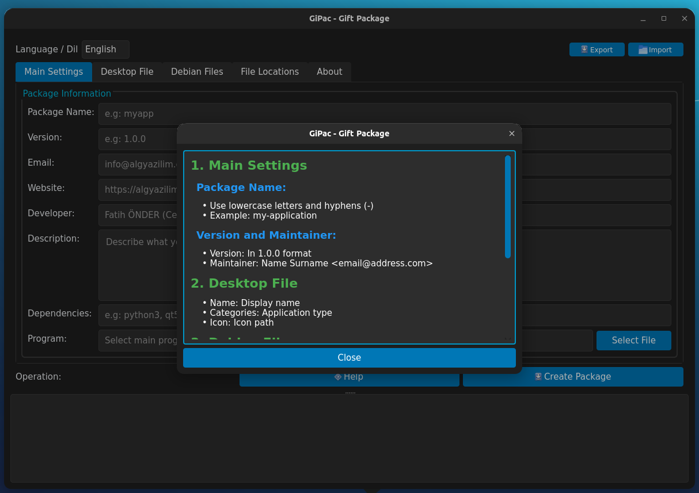

<a href="#">
    
</a>

# GiPac
Debian Package Builder System with a Highly Comprehensive Graphical User Interface


<h1 align="center">GiPac Logo</h1>

<p align="center">
  
</p>

----------------------------------

# Linux Screenshot
  
  
 
  
  
--------------------


# To install directly on Linux


Linux (based debian) Terminal: Linux (debian based distributions) To install directly from Terminal.
```bash
wget -O Setup_Linux64.deb https://github.com/cektor/GiPac/releases/download/1.00/Setup_Linux64.deb && sudo apt install ./Setup_Linux64.deb && sudo apt-get install -f -y
```


Release Page: https://github.com/cektor/GiPac/releases/tag/1.00

